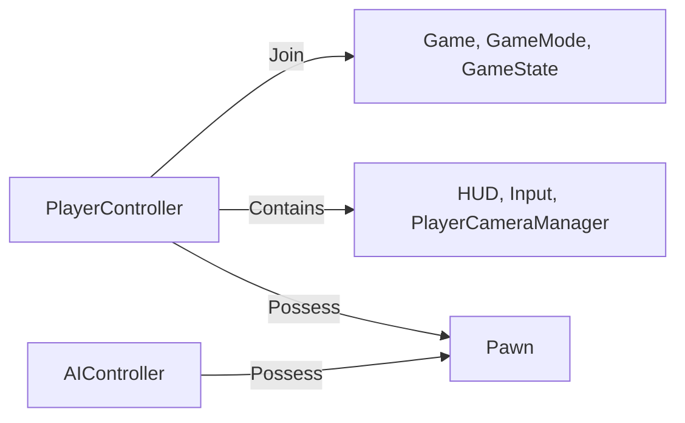

### 웹 서버
- 웹 서버는 주로 텍스트나 이미지와 같은 정적인 콘텐츠를 전송하는 데에 사용되지만, 동적인 콘텐츠도 처리할 수 있습니다. 빠르고 간단한 데이터 처리로 다수의 사용자에게 정보를 쉡게 제공하는 것이 목적
    - 사용자의 브라우저 요청(HTTP/HTTPS)에 맞춰 **웹 페이지**나 **이미지**, **데이터**를 제공

### 게임 서버
- 게임 서버는 웹 서버와 다르게, *실시간 상호작용*과 *복잡한 데이터*를 다룹니다. 예를 들어, 사용자가 게임에서 움직일 때, 다른 사용자에게도 즉시 그 움직임이 반영되어야 하죠.
  이런 상호작용을 원활하게 하기 위해 게임 서버는 많은 사용자의 상태와 게임 데이터를 동시에 처리해야 합니다. 그래서 서버 성능이 중요하며, 일반적으로 웹 서버보다 복잡한 시스템을 갖추고 있습니다.
    - **실시간** 상호작용이 핵심
    - 위치, 아이템, 개릭터 상태 등 **복잡한 데이터**를 빠른 속도로 처리
    - 여러 명이 동시에 접속하므로 **동시 접속자 수**와 **서버 성능**이 중요

### P2P(Peer to Peer)
- 중앙 서버 없이, 플레이어끼리 직접 연결해서 게임 데이터를 주고받는 방식
- 서버 비용은 적지만, 해킹 방어나 속도 문제가 발생하기 쉽다

### 하이브리드
- 부분적으로는 서버가, 부분적으로는 플레이어끼리 통신도 하는 형태
- 다양한 온라인 게임이 상황에 따라 혼합해 사용하기도 함

### 의사결정권자
- PD
    - Project Director 의 약자
    - 한 팀의 헤드 역할을 하며 게임 전반의 방향성을 결정
    - 방송의 PD와 비슷한 역할

- TD
    - Technical Director의 약자
    - 서버 팀, 클라이언팀 등 모든 기술팀의 헤드 역할
    - 전체적인 기술의 흐름 및 방향성을 결정
    - 회사마다 부르는 이름이 다른 경우가 있다. TL(Technical Leader) 등

- AD
    - Art Director의 약자
    - 아트팀의 모든 방향성을 결정
    - 3D 그래픽, 2D 컨셉 등 가능성 여부 결정

### 구성원
- 기획자
    - 스토리 & 레벨 디자인
        - 던전의 구조 , 보스 패턴, 획득 아이템 등이 어떻게 구성될지 세세하게 써 내려감
    - 규칙 & 재미 요소 설계
        - 게임 시스템(전투, 이동, 스킬, 성장 등)부터 세부 난이도까지 일관되고 재밌게 설정
        - 밸런스 패치가 중요한 이유도 기획이 게임의 재미를 결정짓는 핵심이기 때문
    - 협업
        - 기획서대로 아티스트와 프로그래머가 작업할 수 있도록 설명하고, 방향성을 공유

- 프로그래머
    - 대표적으로 클라이언트, 서버 프로그래머로 나뉨
    - 클라이언트에서는 다양한 게임 컨텐츠, 그래픽 구현 및 퍼포먼스 최적화 작업
    - 서버에서는 게임 컨텐츠 개발 및 서버 안정성에 가장 큰 기여를 하며, 데이터 공정성 유지, 치트 방어와 같은 작업들도 진행

### 프레임워크 클래스 관계

- GameMode
    - 현재 게임이 어떤 규칙으로 돌아갈지 정의
- PlayerController
    - 플레이어의 입력을 받아 처리
- Pawn/Character
    - 플레이어 혹은 AI가 조종할 수 있는 오브젝트
- UI
    - 게임 화면에 표시되는 인터페이스

### 액터(Actor)란 무엇인가?
- 언리얼 엔진에서 액터(Actor)는 레벨(맵) 내에 존재하는 모든 오브젝트의 기반 클래스를 의미합니다
    - 건물, 캐릭터, 라이트, 카메라 등 눈에 보이는 오브젝트뿐 아니라 트리거(Trigger)나 볼륨(Volume)처럼 눈에 보이지 않는 것도 모두 액터의 일종
    - 액터마다 고유한 컴포넌트를 지니고 있으며, 위치, 회전, 스케일과 같은 변환(Transform) 정보를 갖습니다

- 기본 액터
    - 트리거나 위치 지정 해주는 용도
    - AI가 왔다갔다 왕복하는 위치를 찍어주는 용도

- 스태틱 매쉬 액터
    - 별다른 기능이 없는 기본적인 표현을 위한 액터