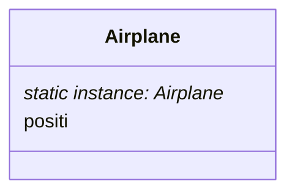

#### 디자인 패턴

- 개발 시 반복적으로 등장하는 문제를 해결하기 위한 일반화 된 솔루션

![[디자인 패턴.png]]

#### 생성 패턴(Creational Patterns)

- 새로운 것을 만들어내는 방법과 관련된 패턴
- 예를 들어 공장에서 물건을 찍어내는 것에 비유할 수 있다
- **싱글톤 패턴(Singleton)**
    - 아래와 같은 요구사항을 가정
         - 비행기 관리
        1. 게임 내 비행기는 오직 하나만 존재
        2. 비행기의 초기 위치는 (0,0) 좌표

        - 비행기 이동
        1. 비행기는 `move(int deltaX, int deltaY)` 메서드를 통해 이동하고, 위치를 업데이트
        2. 현재 비행기 좌표를 확인할 수 있는 `getPosition()`을 제공

     - 문제 상황
         - 비행기 게임을 만들려고 한다
         - 이 때 게임 내 제어하는 비행기는 반드시 하나만 존재
         - 어떻게 하면 내가 만든 프로그램에서 비행기가 하나만 존재하도록 구현할까?
            1. 생성 및 대입을 `private`으로 했다
            2. `getInstance()`를 통해서만 인스턴스를 받는다

#### 구조 패턴(Structual Patterns)

- 여러 부품을 어떻게 조립하고 연결하는 방법에 대한 패턴
- 여러 개의 객체들의 구조를 어떻게 구성할 지가 이 패턴의 주 관심사
- **데코레이터 패턴(Decorator)**
#### 행동 패턴(Behavioral Patterns)

- 부품이 서로 어떻게 상호작용 할 지에 대한 패턴
- 예를 들어 특정 객체가 변할 때 다른 객체들에 이상태를 어떻게 전달할 지에 대한 고민들
- **옵저버 패턴(Observer)**

