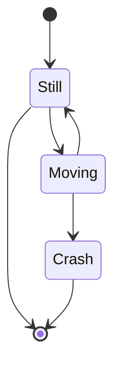

#### 함수 오버로딩

- C++에서 함수 이름과 매개변수 타입 정보를 함께 사용해 구분한다
- 동일한 이름의 함수를 여러 개 정의할 수 있는 것을 **`함수 오버로딩`** 이라고 한다
- 함수 이름 구분을 위해 내부적으로 고유한 이름을 부여하는 것을 **`네임 맹글링(Name Mangling)`** 이라고 한다

- 매개변수 타입이 다른 함수 오버로딩
```
// 목적: 함수 오버로딩의 개념을 매개변수 타입이 다른 경우로 이해하기  
#include <iostream>  
using namespace std;  
    void print(int a) {  
    cout << "정수 출력: " << a << endl;  
}  
    void print(double a) {  
    cout << "실수 출력: " << a << endl;  
}  
    int main() {  
    print(10);     // 정수 출력  
    print(3.14);   // 실수 출력  
    return 0;  
}  
    // 출력결과:  
// 정수 출력: 10  
// 실수 출력: 3.14
```

- 매개변수 개수 다른 함수 오버로딩
```
// 목적: 매개변수의 개수가 달라서 함수 오버로딩이 유효한 경우를 확인하기  
#include <iostream>  
using namespace std;  
    int add(int a, int b) {  
    return a + b;  
}  
    int add(int a, int b, int c) {  
    return a + b + c;  
}  
    int main() {  
    cout << add(1, 2) << endl;        // 두 개의 인자 사용  
    cout << add(1, 2, 3) << endl;     // 세 개의 인자 사용  
    return 0;  
}  
    // 출력결과:  
// 3  
// 6
```


#### 오버로딩이 되지 않는 경우

- 타입 변환이 가능한 매개변수로 인해 두 개 이상의 오버로딩된 함수가 호출 후보가 되는 경우
```
// 목적: 타입 변환 가능한 매개변수로 인해 애매모호성이 발생하는 예시  
#include <iostream>  
using namespace std;  
void print(double a) {  
    cout << "double: " << a << endl;  
}  
void print(long a) {  
    cout << "long: " << a << endl;  
}  
int main() {  
    // print(10);  // int는 long과 double 모두로 변환 가능하므로 애매모호  
    return 0;  
}  
/*  
출력결과 (컴파일 에러):  
error: call of overloaded 'print(int)' is ambiguous  
*/
```

- 디폴트 매개변수로 인해 함수 호출 형태가 중복되는 경우
```
// 목적: 디폴트 매개변수로 인해 호출 형태가 중복되는 경우  
#include <iostream>  
using namespace std;  
void display(int a, int b = 5) {  
    cout << a << ", " << b << endl;  
}  
void display(int a) {  
    cout << a << endl;  
}  
int main() {  
    // display(10); // 디폴트 매개변수로 인해 두 함수 모두 호출 가능하므로 애매모호  
    return 0;  
}  
/*  
출력결과 (컴파일 에러):  
error: call of overloaded 'display(int)' is ambiguous  
*/
```

- 매개변수의 타입만 포인터와 배열로 다른 경우 매개변수의 타입만 포인터와 배열로 다른 경우
```
// 목적: 매개변수의 타입이 포인터와 배열일 때 애매모호성 발생 예시  
#include <iostream>  
using namespace std;  
void print(int* arr) {  
    cout << "포인터 호출됨" << endl;  
}  
void print(int arr[]) {  
    cout << "배열 호출됨" << endl;  
}  
int main() {  
    int data[3] = {1, 2, 3};  
    // print(data); // 포인터와 배열은 같은 타입으로 취급되어 애매모호  
    return 0;  
}  
/*  
출력결과 (컴파일 에러):  
error: redefinition of 'void print(int*)'  
배열과 포인터는 매개변수로 구분되지 않음  
*/
```

- 함수의 반환 타입만 다른 경우
```
// 목적: 반환 타입만 다른 함수 오버로딩으로 애매모호성 발생  
#include <iostream>  
using namespace std;  
// int getValue() {  
//     return 10;  
// }  
// double getValue() {  
//     return 3.14;  
// }  
int main() {  
    // cout << getValue(); // 반환 타입만으로는 함수를 구별할 수 없으므로 애매모호  
    return 0;  
}  
/*  
출력결과 (컴파일 에러):  
error: functions that differ only in their return type cannot be overloaded  
*/
```


#### 함수 오버로딩의 순서

